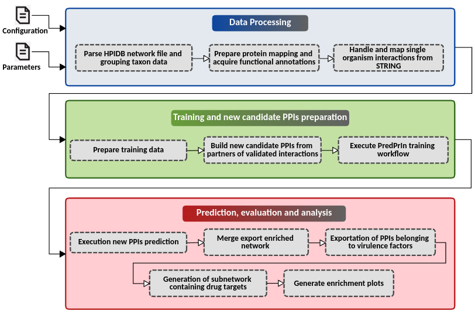

# HPPIDiscovery

Scientific workflow to augment, predict and evaluate host-pathogen protein-protein interactions

## Summary
HPPIDiscovery is a scientific workflow to augment, predict and perform an insilico curation of host-pathogen Protein-Protein Interactions (PPIs) using graph theory to build new candidate ppis and machine learning to predict and evaluate them by combining multiple PPI detection methods of proteins according to three categories: structural,  based on primary aminoacid sequence and functional annotations.<br>

HPPIDiscovery contains three main steps: (i) acquirement of pathogen and host proteins information from seed ppis provided by HPIDB search methods, (ii) Model training and generation of new candidate ppis from HPIDB seed proteins' partners, and (iii) Evaluation of new candidate ppis and results exportation.

(i) The first step acquires the identification of the taxonomy ids of the host and pathogen organisms in the result files. Then it proceeds parsing and cleaning the HPIDB results and downloading the protein interactions of the found organisms from the STRING database. The string protein identifiers are also mapped using the id mapping tool of uniprot API and we retrieve the uniprot entry ids along with the functional annotations, sequence, domain and kegg enzymes.

(ii) The second step builds the training dataset using the non redundant hpidb validated interactions of each genome as positive set and random string low confidence ppis from each genome as negative set. Then, PredPrin tool is executed in the training mode to obtain the model that will evaluate the new candidate PPIs. The new ppis are then generated by performing a pairwise combination of string partners of host and pathogen hpidb proteins. 

Finally, (iii) in the third step, the predprin tool is used in the test mode to evaluate the new ppis and generate the reports and list of positively predicted ppis.

The figure below illustrates the steps of this workflow.

<div style="text-align: center">
	
</div>

## Requirements:
* Edit the configuration file (config.yaml) according to your own data, filling out the following fields:
	- base_data: location of the organism folders directory, example: /home/user/data/genomes 
	- parameters_file: Since this workflow may perform parallel processing of multiple organisms at the same time, you must prepate a tabulated file containng the genome folder names located in base data, where the hpidb files are located. Example: /home/user/data/params.tsv. It must have the following columns: genome (folder name), hpidb_seed_network (the result exported by one of the search methods available in hpidb database), hpidb_search_method (the type of search used to generate the results) and target_taxon (the target taxon id). The column hpidb_source may have two values: keyword or homology. In the keyword mode, you provide a taxonomy, protein name, publication id or detection method and you save all results (mitab.zip) in the genome folder. Finally, in the homology mode allows the user to search for host pathogen ppis giving as input fasta sequences of a set of proteins of the target pathgen for enrichment (so you have to select the search for a pathogen set) and you save the zip folder results (interaction data) in the genome folder. This option is extremely useful when you are not sure that your organism has validated protein interactions, then it finds validated interactions from the closest proteins in the database. In case of using the homology mode, the identifiers of the pathogens' query fasta sequences must be a Uniprot ID. All the query protein IDs must belong to the same target organism (taxon id).

## Usage Instructions
The steps below consider the creation of a sqlite database file with all he tasks events which can be used after to retrieve the execution time taken by the tasks. It is possible run locally too (see luigi's documentation to change the running command). <br ><br>
* Preparation:
	1. ````git clone https://github.com/YasCoMa/hpdiscovery.git````
	2. ````cd hpdiscovery````
	3. ````mkdir luigi_log```` 
	4. ````luigid --background --logdir luigi_log```` (start luigi server)
	5. conda env create -f hp_ppi_augmentation.yml
	6. conda activate hp_ppi_augmentation
	6.1. (execute ````pip3 install wget```` (it is not installed in the environment))
	7. run ````pwd```` command and get the full path
	8. Substitute <path> in config_example.yaml with the full path obtained in the previous step
	9. ````cd workflow_hpAugmentation````
	10. snake -n (check the plan of jobs, it should return no errors and exceptions)
	11. snakemake -j 4 (change this number according the number of genomes to analyse and the amount of cores available in your machine)
	
### Exporting conda environment dependencies
conda env export > hp_ppi_augmentation.yml

